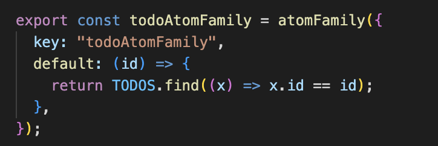
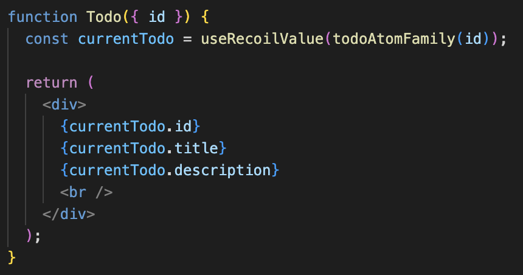

# Atom Family

Atom family allows us to create atoms dynamically rather than defining them in advance. This can be useful when we need a large number of similar elements.

## Defining an atom family

Atom family can have functions as defaults and returns an individual atom.
It does not re-creates the atoms with same specs, but it returns the same atom again.

## Usage

It is used same as atoms by using hooks like 'useRecoilValue' and 'useSetRecoilState'.

## Advantages

Atom families automatically manage the creation and usage of atoms based on parameters. This can lead to a more efficient Recoil tree, especially in scenarios where you have a large number of dynamic state instances.

Atom families are particularly beneficial when dealing with dynamic or parameterized state.
