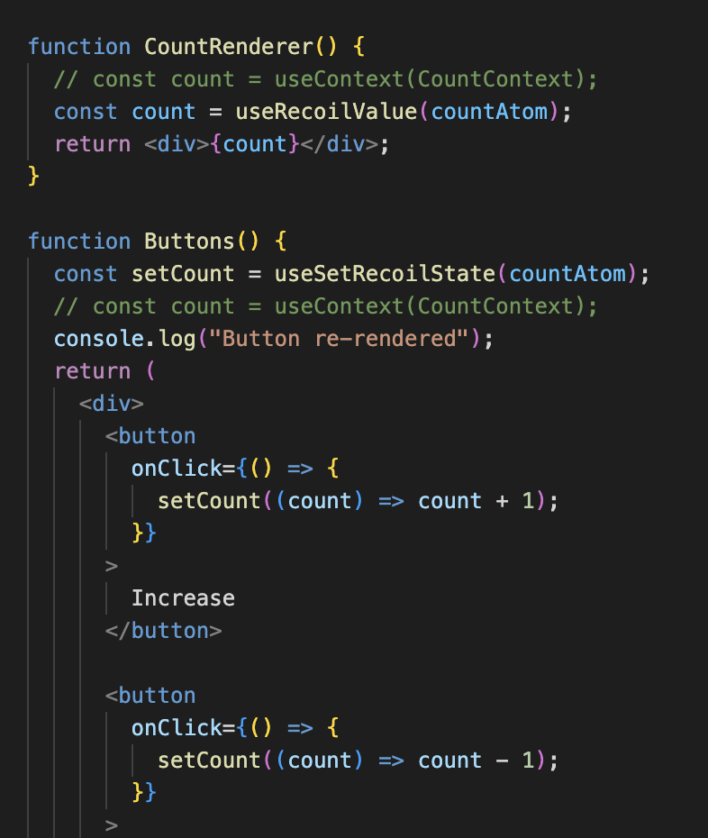

## Recoil

Recoil is a state management library developed by Facebook specifically for React applications.

It introduces the concept of atoms and selectors, providing a more flexible and scalable approach to managing and sharing state.

# Problem

Context APIs re-rendering issue

## Usage

# 1. Define an atom

# 2. Recoil root wrapper

# hooks usage

