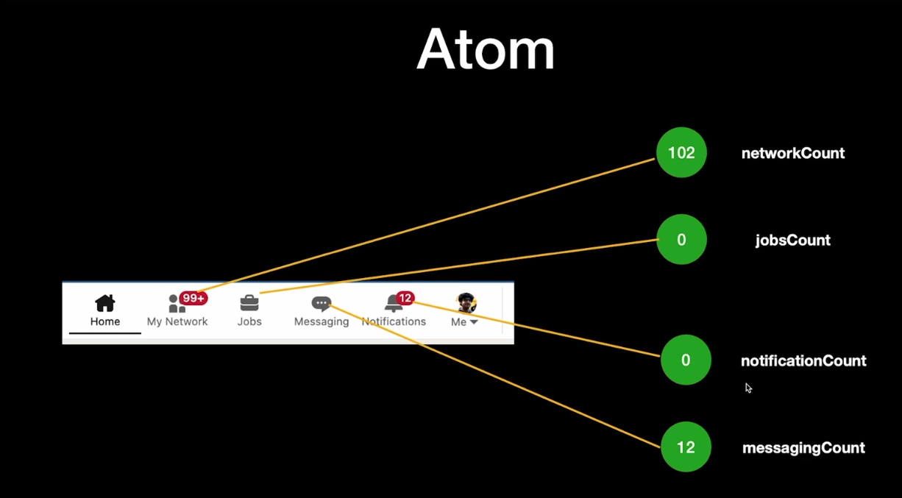
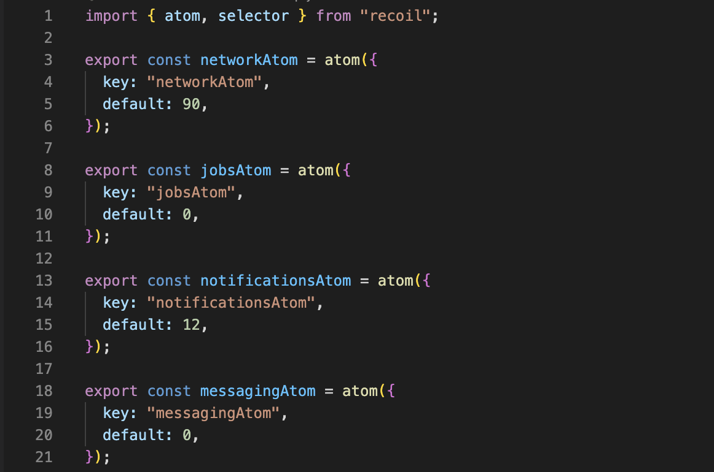
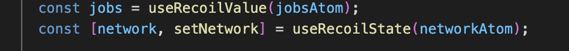
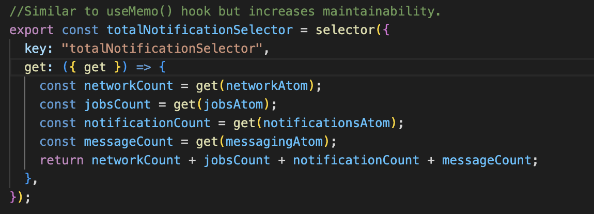

# Recoil

Recoil is a state management library that solves the re-rendering issue unlike context APIs in react.

In this app we are trying to build a dynamic navbar that looks something like this using recoil hooks and selectors:

## Atom

Smallest unit of recoil

## Defining an atom / state variable in recoil

## Recoil hooks and its usage

## Selectors

Selectors are used to derive data from atoms, they can be derived synchronously or asynchronously. They will automatically track dependencies for you using get function.

Selectors are used to derive data from atoms, they can be derived based on other atoms or derived from multiple atoms at once.

They will automatically update when any dependencies change.

